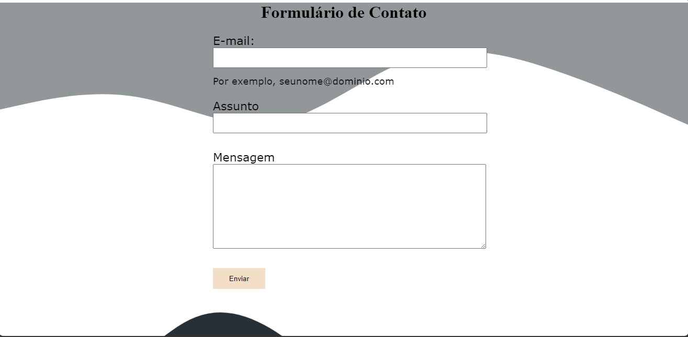
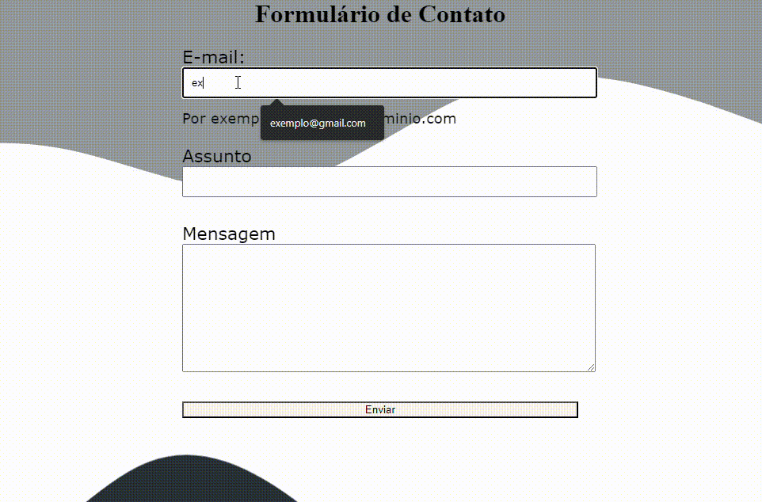

# Formulário de Contato
Um formulário de contato que tem o interesse de te dar a oportunidade de falar caso você esteja tendo algum problema. 

## Descrição
Um formulário criado na aula de Fundamentos de desenvolvimento Web no intuito de ensinar tanto como criar um formulário, como para criar um README, atraente visualmente, útil e intuitivo. Tendo suas descrições sobre o projeto autoexplicativas. 

## Função
O site tem a função inicial de apenas mostrar áreas onde você pode colocar seu email, "assunto", do motivo de você estar fazendo contato, e "mensagem", aonde você poderia enviar uma mensagem explicativa informando detalhadamente o motivo do contato.

## Tecnologias utilizadas 

* ``HTML 5``
* ``CSS 3``
* ``Github``
* ``VsCode``
* ``Microsoft Teams``

## Referência
* [Alura](https://www.alura.com.br/artigos/escrever-bom-readme) - Como escrever um README incrível no seu Github

## Autor
Kleyverson